# kotor-mod-electrical-swords

## Summary

A mod for "Star Wars : Knights of the Old Republic" that modify the
appearance of melee swords by electrical swords for a more
STAR WARS-like look.

This mod changes the appearance of every iron sword in the game.
Every original sword has been slightly modified to add a colored
glowing effect on the blade.
The idea was to keep the original look of each iron sword while
adding this futuristic glow

## Install

Two version are available, `tga` or `tpc`, that can be found in
the `install` folder.
Put the content of the `override` folder into the `override`
folder of your game.

## Tested game versions

| Platform         | Works | Comment                                                   |
|------------------|-------|-----------------------------------------------------------|
| PC - Steam       | ✅️    |                                                           |
| PC - Original CD | ✅️    |                                                           |
| macOS            | ✅️    |                                                           |
| Nintendo Switch  | ✅     | Only the `tpc` version                                    |
| iOS              | ✅     | Only the `tga` version                                    |
| XBox             | ❌     | `.mdl` files make the game crash when displayed on screen |

## Screeshots

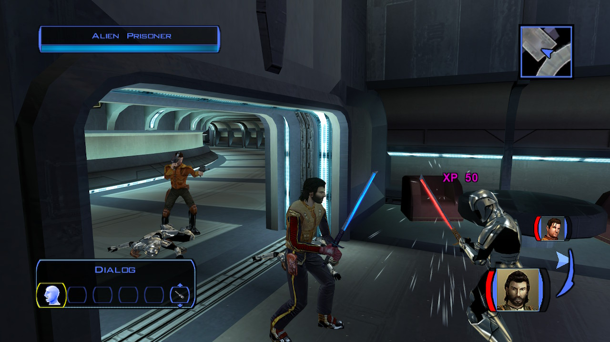
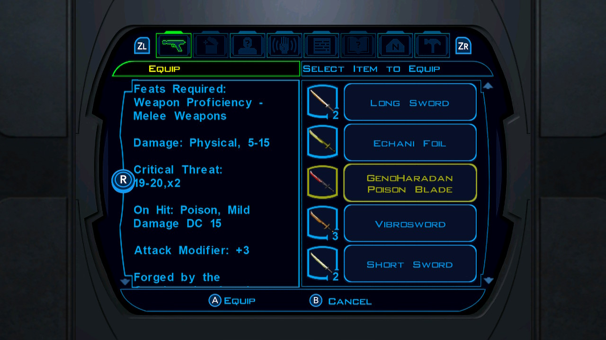

  
<b>Spoiler: More Screenshots</b>

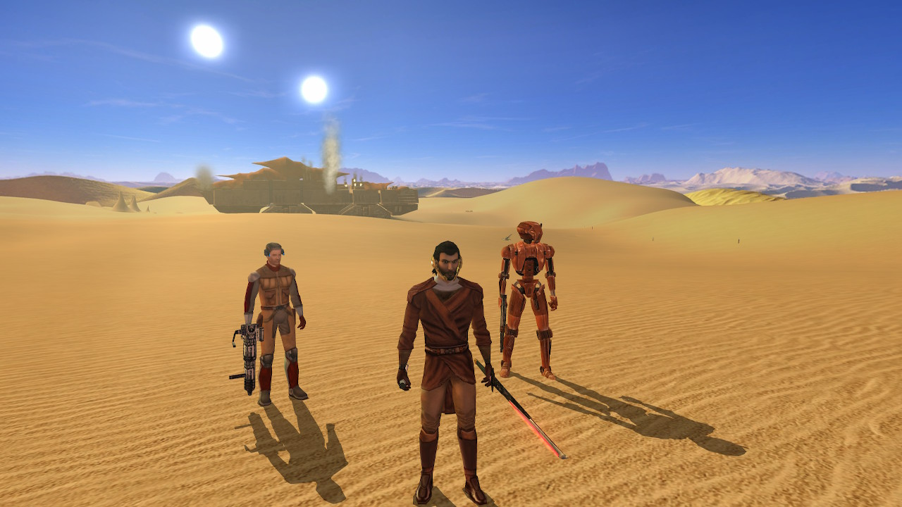
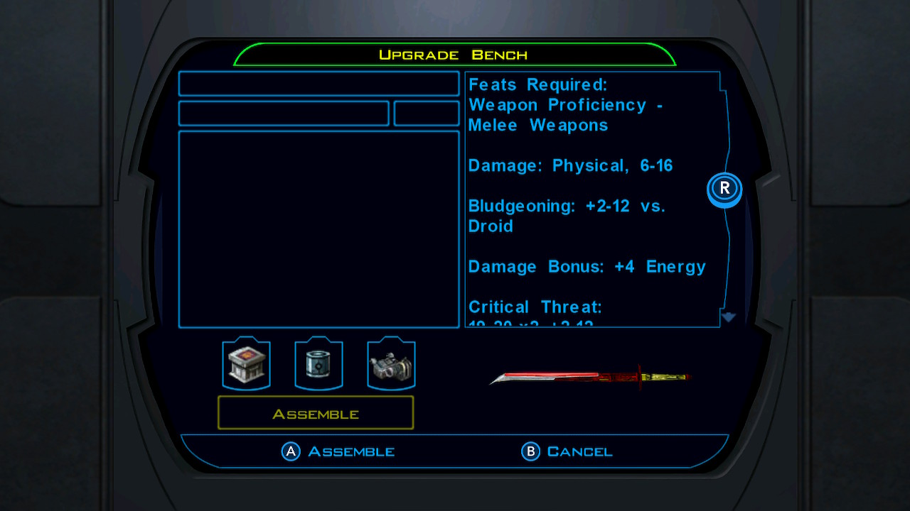
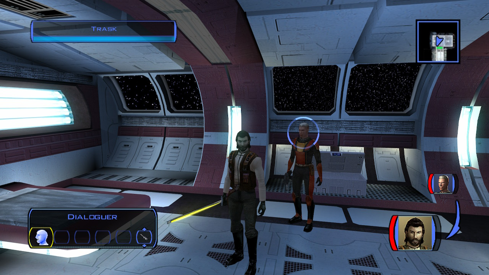
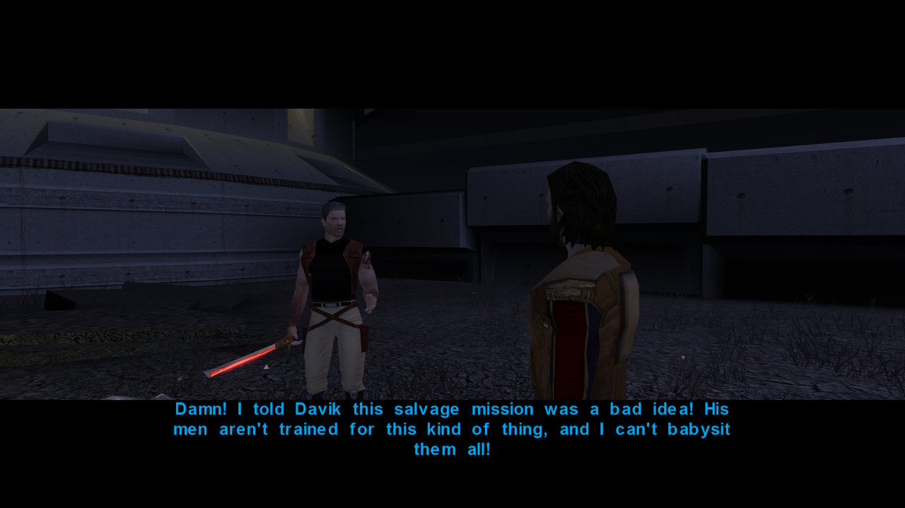
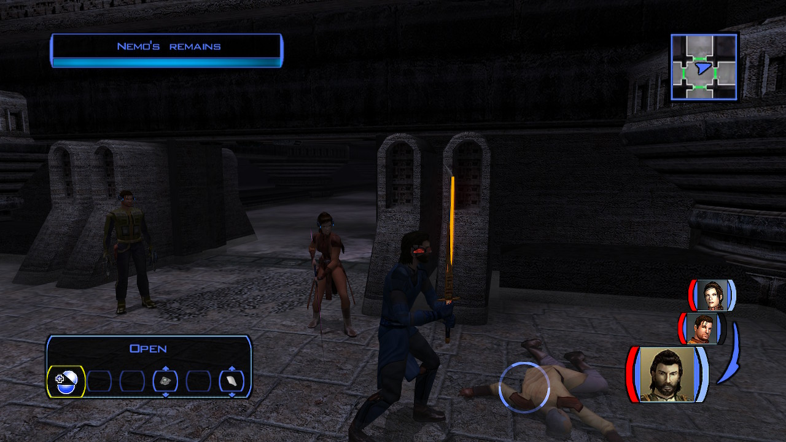
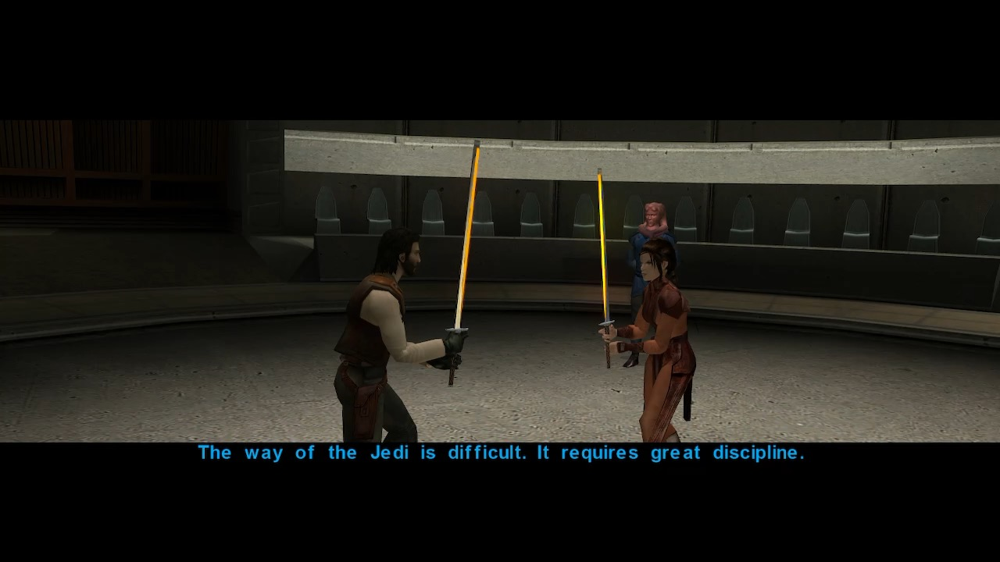
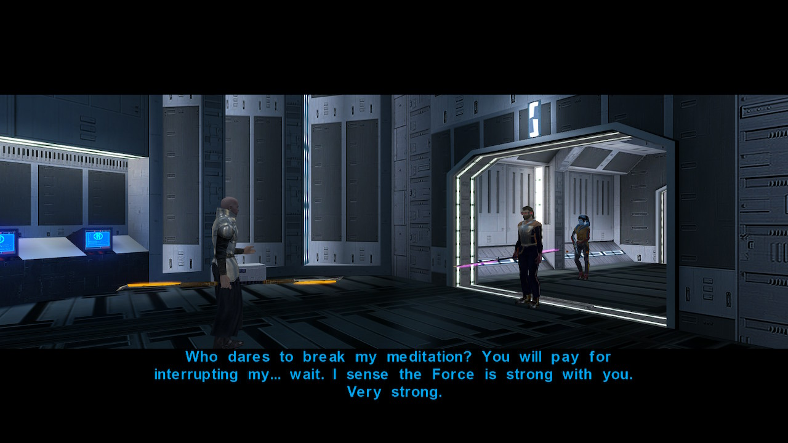
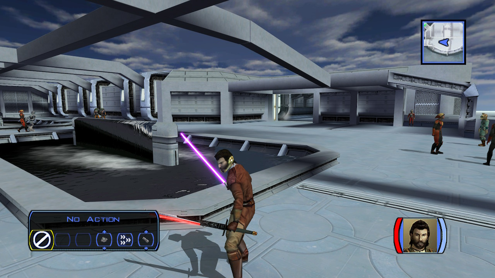
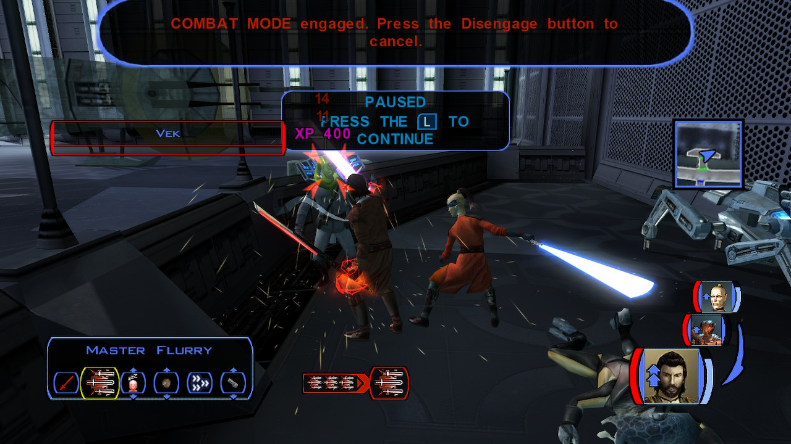

## Credits

The glowing textures were taken from the original mod 
[Vibrosword replacement pack 1.0](https://deadlystream.com/files/file/65-vibrosword-replacement-pack/)
by [DeadMan](https://deadlystream.com/profile/8930-deadman/).

The electric buzz sound were taken from the sound bank of 
original PS1 game 
[Star Wars: Episode I – The Phantom Menace](https://en.wikipedia.org/wiki/Star_Wars:_Episode_I_%E2%80%93_The_Phantom_Menace_(video_game)).

## Permissions

Under NO CIRCUMSTANCES ANY OF MY MODS TO BE UPLOADED TO STEAM WORKSHOP.
Anything else - be my guest, use like you want, just give credit to me.

